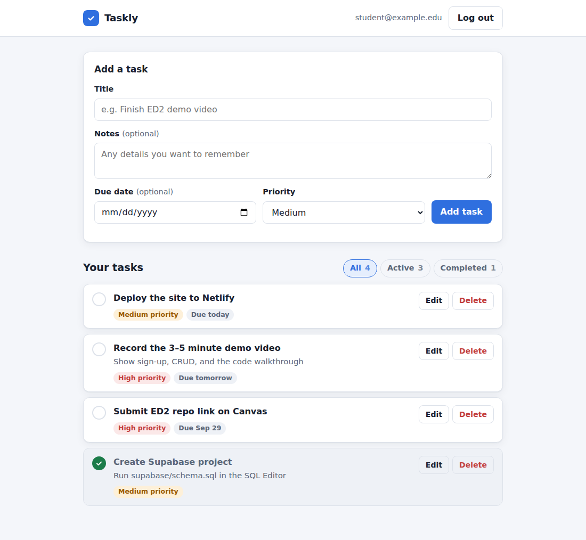
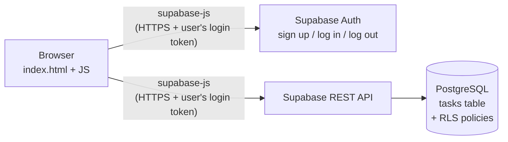

# Taskly: a simple task manager

Taskly is a small web app for keeping track of to-dos. You create an account, add tasks with optional notes, due dates, and priorities, check them off when they're done, and edit or delete them. Tasks are stored in a cloud database, so they're still there when you come back from any device.

Built for **Engineering Design 2** (AI Hootcamp assignment).

- **Live app:** https://YOUR-SITE-NAME.netlify.app ← _replace after deploying_
- **Demo video:** https://youtu.be/YOUR-VIDEO-ID ← _replace after uploading (unlisted)_



---

## What the app does

- **User accounts:** sign up, log in, and log out with email and password. You stay logged in after a page refresh.
- **Create tasks:** each task has a title, plus optional notes, a due date, and a priority (low / medium / high).
- **View tasks:** your tasks are listed with unfinished ones first, sorted by due date. Overdue tasks are highlighted.
- **Update tasks:** check a task off (or un-check it), or open **Edit** to change any field.
- **Delete tasks:** remove a task (with a confirmation prompt).
- **Filter:** switch between All, Active, and Completed, with a count on each.
- **Private data:** every user only sees their own tasks. This is enforced by the database itself (Row Level Security), not just hidden in the page.
- Works on phones and desktops, with automatic dark mode.

## Technologies used

| Part | Technology |
|---|---|
| Frontend | HTML, CSS, and plain JavaScript (ES modules), no framework and no build step |
| Backend / database | [Supabase](https://supabase.com) (PostgreSQL database + Supabase Auth), free tier |
| Database client | [`supabase-js`](https://supabase.com/docs/reference/javascript) v2, loaded from the jsDelivr CDN |
| Security | PostgreSQL Row Level Security (RLS) policies |
| Hosting | [Netlify](https://www.netlify.com) (static site hosting), free tier |
| Version control / CI | Git, GitHub, and a GitHub Actions workflow that checks the code on every push |
| Development | Built with AI coding assistance, as taught in the Hootcamp lectures |

## How it works



1. The page is a static website hosted on Netlify. There is no custom server.
2. When you sign up or log in, `supabase-js` talks to **Supabase Auth**, which returns a login token (a JWT) that is saved in the browser.
3. Every database request (read, create, update, delete) is sent to Supabase's REST API with that token.
4. **Row Level Security** policies in PostgreSQL check the token on every row: a user can only select, insert, update, or delete rows where `user_id` matches their own ID. The key in `js/config.js` is a *publishable* key, so it is safe to be public. On its own it can't read anyone's data.

## Project structure

```text
.
├── index.html              # Page layout: login screen, task form, task list, edit dialog
├── css/
│   └── style.css           # All styles (light + dark mode, mobile layout)
├── js/
│   ├── config.js           # Supabase project URL + publishable key (edit this)
│   ├── supabaseClient.js   # Creates the shared Supabase client
│   ├── auth.js             # signUp, signIn, signOut, onAuthChange
│   ├── tasks.js            # getTasks, createTask, updateTask, deleteTask (CRUD)
│   └── app.js              # UI logic: connects the page to auth.js and tasks.js
├── supabase/
│   └── schema.sql          # Creates the tasks table, trigger, and RLS policies
├── docs/
│   └── screenshot.png
├── .github/workflows/
│   └── check.yml           # GitHub Actions: syntax check + "no secret key" check
├── netlify.toml            # Tells Netlify to serve this folder as-is
└── README.md
```

The code is split by responsibility: **`auth.js`** and **`tasks.js`** are the only files that talk to Supabase, and **`app.js`** only handles what you see and click. That keeps the database code short and easy to find.

### Database table: `tasks`

| Column | Type | Notes |
|---|---|---|
| `id` | bigint | Primary key, auto-generated |
| `user_id` | uuid | Owner of the task. Defaults to the logged-in user (`auth.uid()`) |
| `title` | text | Required, 1–200 characters |
| `description` | text | Optional notes |
| `due_date` | date | Optional |
| `priority` | text | `low`, `medium` (default), or `high` |
| `is_complete` | boolean | Defaults to `false` |
| `created_at` / `updated_at` | timestamptz | Set automatically (`updated_at` by a trigger) |

## Setup instructions

You need a free [Supabase](https://supabase.com) account, and a free [Netlify](https://www.netlify.com) account to deploy.

### 1. Create the database

1. In Supabase, create a **New project** (any name and region; save the database password somewhere).
2. When the project is ready, open **SQL Editor** → **New query**.
3. Paste the entire contents of [`supabase/schema.sql`](supabase/schema.sql) and click **Run**. You should see "Success. No rows returned."
4. Check **Table Editor**: a `tasks` table should now exist, marked as RLS-enabled.

### 2. Configure sign-up emails (recommended for testing)

By default Supabase makes new users confirm their email before they can log in, and the free built-in email service only sends a few emails per hour. To keep things simple:

- Go to **Authentication** → **Sign In / Providers** → **Email**, turn **off** "Confirm email", and save.

(If you leave it on, the app still works. It will tell new users to check their inbox. In that case also set **Authentication → URL Configuration → Site URL** to your Netlify URL so the confirmation link opens your site.)

### 3. Connect the app to your project

1. In Supabase, open **Project Settings** → **API Keys** (or click **Connect** at the top of the dashboard).
2. Copy your **Project URL** and your **publishable key** (or the legacy **anon public** key).
3. Paste them into [`js/config.js`](js/config.js):

   ```js
   export const SUPABASE_URL = 'https://your-project-id.supabase.co';
   export const SUPABASE_KEY = 'sb_publishable_...';
   ```

> ⚠️ Never use the **secret** / **service_role** key in this file. It bypasses all security rules. The GitHub Actions check will fail if a secret key is committed.

### 4. Run it locally

The app uses JavaScript modules, so it must be opened through a local web server (double-clicking `index.html` won't work). Pick one:

- **VS Code:** install the **Live Server** extension, right-click `index.html` → **Open with Live Server**.
- **Python:** in this folder run `python -m http.server 8000`, then open <http://localhost:8000>.
- **Node:** run `npx serve .` and open the address it prints.

### 5. Deploy to Netlify

Deploy once, when the project is finished (to stay within Netlify's free limits). Either option works:

- **Drag and drop (simplest):** log in to Netlify, go to <https://app.netlify.com/drop>, and drag this project folder onto the page. Netlify gives you a `netlify.app` URL right away.
- **From GitHub:** in Netlify choose **Add new project → Import an existing project → GitHub**, pick this repository, leave the build command empty, set the publish directory to `.`, and deploy. (Note: this redeploys on every push.)

**Then make it public.** New Netlify projects on the free plan are *private* by default, so other people see an "access denied" page. In your project, click **Make public** (or go to **Project configuration → General → Visitor access → Project visibility** and choose public). The Make public screen also lets you change the project name, which sets the `netlify.app` address. Open the URL in a private/incognito window to confirm anyone can see it.

Finally, put the live URL at the top of this README.

## Possible future improvements

- Password reset ("forgot password") flow
- Search and sort options (by priority, by date created)
- Categories or tags for tasks
- Real-time sync between open tabs using Supabase Realtime

## Author

**YOUR NAME** · Engineering Design 2
